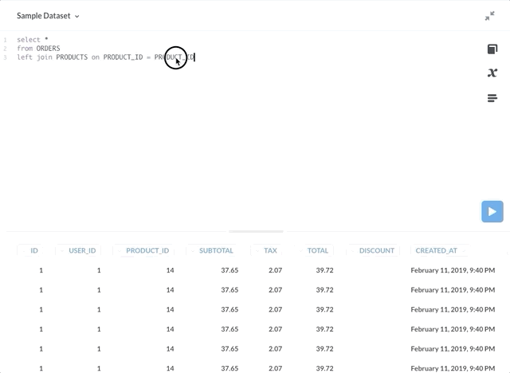

## SQL snippets



**SQL snippets** are reusable bits of SQL. Anyone can create and edit snippets, and snippets become available for all to take advantage of.

For example, if you frequently perform queries that involve multiple tables, you can save the statement that joins those tables as a snippet to use in multiple questions.

Metabase's [Enterprise edition](https://www.metabase.com/docs/latest/enterprise-guide/start.html) adds additional functionality for managing snippets at scale by offering **folder organization** and **group-level permissions**.

### How to create a snippet

To illustrate how to create a SQL snippets, here's a simple query with a simple join using the **Sample Dataset** included with Metabase.

```sql
select *
from ORDERS
left join PRODUCTS on PRODUCT_ID = PRODUCT_ID;
```

We can save the join statement as a snippet to reuse in other queries.

In the **SQL editor**:
 
1. **Highlight a section of SQL** that you want to snip. In this case, we'll snip `from ORDERS left join PRODUCTS on PRODUCT_ID = PRODUCT_ID`.
2. **Right-click on the highlighted section**.
3. **Select Save as snippet** to create a snippet. A modal will pop up with the SQL statement you highlighted. 
4. **Edit, name, and describe your snippet**, then click the save button.

The snippet will now be available for anyone to use. Here's what it looks like:

```sql
select * 
{{snippet: Orders and Products}};
```

You can start typing `{{snippet:` and Metabase will present autocomplete options for available snippets.

### Snippet menu

The SQL editor **sidebar** has a snippets menu to list available and archived snippets.

Click on the code icon on the right side of the SQL editor, below **Data Reference** book icon (learn about your data) and the **Variables** χ icon. Metabase will slide out a sibebar menu that lists available snippets.

Click on a snippet to insert it into your query at the current cursor point.

Click on the down arrow to the right of a snippet to see a preview of its SQL code.

![TODO image of preview]

You can **edit** the snippet. You can change the SQL code, name, and description. You can also **archive** the snippet, which removes the snippet from the menu, but does not affect any existing queries that use the snippet.

### Archived snippets

**Archived snippets** are snippets that are no longer available in menus, which can help keep dated or less relevant snippets out of the way. When you archive a snippet, the snippet no longer populates in the snippet autocomplete dropdown, and it does not show up in the list of of snippets in the SQL editor sidebar.

You can access an archived snippet from the snippet sidebar menu by clicking on the archived button in the bottom left of the sidebar.

You can archive and unarchive a snippet at any time.

**Archiving** does _not_ affect how **snippets** work in queries, so you can change the **archive** status of a snippet without breaking anyone's query.

### Enterprise edition features

The Enterprise edition of Metabase supports some organizational functionality for **snippets** to help admins organize and control access to **SQL snippets**.

